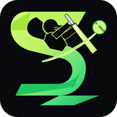

# StrydeX 2.0 — AI-Powered Cricket Performance Platform

<p align="center">
  
</p>

<p align="center">
  <strong>Train Smarter. Play Better.</strong><br/>
  High-speed computer vision biomechanics (120 FPS CV), match telemetry, and Gemini-powered AI cricket coaching.
</p>

<p align="center">
  
  
  
  
  
</p>

---

## 🏗️ Repository Architecture

The StrydeX project has been organized into a modular fullstack architecture:

```
strydeX-2.0/
├── frontend/                     # React 19 + TypeScript + Vite + Tailwind v4 + Three.js
│   ├── public/                   # Static assets & SVG icons
│   │   └── strydex-logo.svg
│   ├── src/
│   │   ├── components/
│   │   │   ├── 3d/               # Three.js WebGL & 3D visualizations
│   │   │   │   ├── HeroCricketBall3D.tsx     # Interactive raymarched cricket ball
│   │   │   │   ├── SkeletonPose3D.tsx        # 3D 17-point kinematic skeletal joint visualizer
│   │   │   │   ├── Pitch3D.tsx               # 22-yard turf pitch coordinate visualizer
│   │   │   │   ├── Cylindrical3DCarousel.tsx # 3D rotational carousel
│   │   │   │   ├── PerspectiveGrid.tsx       # Kinetic depth grid
│   │   │   │   ├── RefractionLens.tsx        # High-index optical glass lens
│   │   │   │   └── ThreeCricketBall.tsx      # Dual-seam procedural cricket ball
│   │   │   ├── analytics/        # Batting, bowling, fielding & fitness telemetry
│   │   │   ├── athlete/          # Athlete profile & public scout portfolio
│   │   │   ├── auth/             # Sign-in & sign-up flows
│   │   │   ├── dashboard/        # Central command dashboard with KPIs & feeds
│   │   │   ├── landing/          # Hero, live preview, feature grid & pricing
│   │   │   ├── layout/           # AppLayout, Navbar with connection indicator, Footer
│   │   │   ├── onboarding/       # 4-step interactive athlete calibration flow
│   │   │   ├── settings/         # Bio, preferences, sensors, security
│   │   │   ├── training/         # Drill catalog, development goals, progress bars
│   │   │   ├── ui/               # 3D tilt cards, counters, toasts, modals
│   │   │   └── video/            # AI video analysis & biomechanics overlays
│   │   ├── context/
│   │   │   └── AppContext.tsx    # State management with backend sync + offline fallback
│   │   ├── lib/
│   │   │   └── mock-data.ts      # Seed telemetry, drills, goals, and profiles
│   │   ├── services/
│   │   │   └── api.ts            # Typed REST API client with reverse proxy support
│   │   ├── types/
│   │   │   └── index.ts          # Cricket domain TypeScript interfaces
│   │   ├── App.tsx
│   │   ├── main.tsx
│   │   └── index.css             # Tailwind v4 theme tokens & custom animations
│   ├── index.html
│   ├── vite.config.ts            # Proxies `/api` -> `http://localhost:5000`
│   ├── package.json
│   └── tsconfig.json
│
├── backend/                      # Node.js + Express + TypeScript + Google GenAI
│   ├── src/
│   │   ├── config.ts             # Port, CORS, and Gemini API keys
│   │   ├── server.ts             # Express server, middlewares, error handlers
│   │   ├── data/
│   │   │   └── initialStore.ts   # Seed athlete store (Arjun Sharma, STX-8492)
│   │   ├── routes/
│   │   │   ├── auth.ts           # /api/auth (login, register, me, logout)
│   │   │   ├── profile.ts        # /api/profile (get, update, public scout profile)
│   │   │   ├── matches.ts        # /api/matches (get, create, delete, stats)
│   │   │   ├── videos.ts         # /api/videos (get, analyze, upload)
│   │   │   ├── training.ts       # /api/training (drills, goals, programs)
│   │   │   ├── analytics.ts      # /api/analytics (summary, trends, zones, dismissals)
│   │   │   └── aiCoach.ts        # /api/ai (Gemini 2.5 Flash cricket coach & biomechanics)
│   │   ├── services/
│   │   │   ├── biomechanicsEngine.ts # Kinematic sports science calculator
│   │   │   ├── dataStore.ts      # In-memory CRUD data store
│   │   │   └── geminiService.ts  # Google GenAI integration with heuristic fallback
│   │   └── types/
│   │       └── index.ts          # Backend cricket domain interfaces
│   ├── .env.example
│   ├── .env
│   ├── package.json
│   └── tsconfig.json
│
├── package.json                  # Root monorepo scripts
└── README.md
```

---

## ⚡ Quick Start

### 1. Install Dependencies

You can install dependencies for both services:

```bash
# Install frontend dependencies
cd frontend
npm install

# Install backend dependencies
cd ../backend
npm install
```

### 2. Configure Environment Variables

The backend includes a pre-configured `.env` file:

```env
PORT=5000
CORS_ORIGIN=http://localhost:5173
NODE_ENV=development
# Optional: Add your Gemini API key for live AI coaching responses
GEMINI_API_KEY=
```

*(If no `GEMINI_API_KEY` is provided, the backend automatically uses its built-in cricket sports science heuristic engine.)*

### 3. Run the Development Servers

From the root directory:

```bash
# Run the backend (starts Express on http://localhost:5000)
npm run backend:dev

# Run the frontend (starts Vite on http://localhost:3000)
npm run frontend:dev
```

Or run them individually inside their folders:
```bash
# In frontend/:
npm run dev

# In backend/:
npm run dev
```

Open your browser at **`http://localhost:3000`** (or the port shown in your terminal).

---

## 🔗 Frontend-Backend Integration

- **Reverse Proxy**: In development, `frontend/vite.config.ts` automatically proxies all `/api/*` network requests to `http://localhost:5000`.
- **Typed Client**: `frontend/src/services/api.ts` provides strongly-typed async calls for all backend features.
- **Optimistic State & Offline Resilience**: `frontend/src/context/AppContext.tsx` automatically detects whether the backend server is reachable.
  - When **connected**: Updates sync directly to the backend Express server.
  - When **offline**: Operates seamlessly in local mode with `localStorage` persistence and displays a live connection status pill in the top navigation bar.

---

## 📡 Backend REST API Reference

| Method | Endpoint | Description |
|---|---|---|
| `GET` | `/api/health` | Service health status, uptime, and timestamp |
| `POST` | `/api/auth/login` | Authenticate athlete (`email`, `password`) |
| `POST` | `/api/auth/register` | Register new athlete account |
| `GET` | `/api/auth/me` | Fetch active authenticated athlete |
| `GET` | `/api/profile` | Retrieve athlete profile details |
| `PUT` | `/api/profile` | Update athlete profile details |
| `GET` | `/api/profile/public/:username` | Public shareable scout profile |
| `GET` | `/api/matches` | Get all match logs |
| `POST` | `/api/matches` | Log a new match performance |
| `DELETE`| `/api/matches/:id` | Delete a match log |
| `GET` | `/api/matches/stats` | Aggregated batting & bowling stats |
| `GET` | `/api/videos` | Fetch all biomechanical video analysis sessions |
| `GET` | `/api/videos/:id` | Fetch specific video session by ID |
| `POST` | `/api/videos/analyze` | Run 120 FPS CV kinematic simulation and return analysis |
| `GET` | `/api/training/drills` | Fetch all training drills |
| `POST` | `/api/training/drills` | Create a new training drill |
| `PATCH`| `/api/training/drills/:id/toggle` | Toggle drill completion status |
| `GET` | `/api/training/goals` | Fetch all development goals |
| `POST` | `/api/training/goals` | Create a new development goal |
| `PATCH`| `/api/training/goals/:id/toggle` | Toggle goal completion status |
| `DELETE`| `/api/training/goals/:id` | Delete a development goal |
| `GET` | `/api/training/programs` | List curated training programs |
| `GET` | `/api/analytics/summary` | Batting, bowling, fielding & fitness KPI summary |
| `GET` | `/api/analytics/trends` | Time series trends (`7D`, `30D`, `90D`, `All Time`) |
| `GET` | `/api/analytics/zones` | Wagon wheel radial scoring zones |
| `GET` | `/api/analytics/dismissals` | Dismissal vulnerability breakdown |
| `POST` | `/api/ai/coach` | Ask StrydeX AI Coach (Gemini 2.5 Flash / Heuristic) |
| `POST` | `/api/ai/biomechanics` | Automated kinematic evaluation of cricket shots |

---

## 🏏 Key Features

1. **3D WebGL Cricket Physics**: Interactive Three.js dual-seam red leather ball with specular reflections, seam rotation, and physics-based lighting.
2. **Kinematic Computer Vision (120 FPS)**: 17-point skeletal landmark tracking, lead elbow angle calculation, head stability index, and weight transfer phase timeline.
3. **Multi-Format Match Telemetry**: T20, 50-Over, Red Ball, and Net practice logging with wagon wheel scoring zones and pitch length distributions.
4. **Development Goals & Drills**: SMART milestone tracking with category breakdown (Technique, Tactical, Fitness, Mental) and interactive drill checklist.
5. **Verified Scout Portfolio**: Shareable public digital athlete profiles with QR codes for scouts, coaches, and academy selection trials.
6. **Gemini 2.5 Flash AI Coach**: Intelligent cricket coaching engine calibrated with sports science principles and tactical drills.

---

<p align="center">
  <strong>StrydeX</strong> — Train Smarter. Play Better.
</p>
