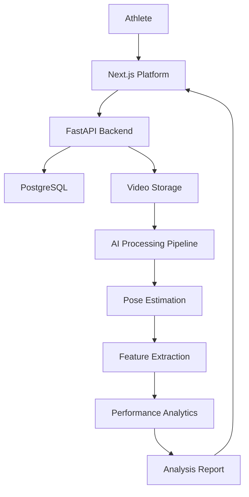

# StrydeX

### AI-Powered Cricket Performance & Athlete Development

  <strong>Train Smarter. Play Better.</strong>

  Turning cricket videos and performance data into actionable insights for every athlete.

  
  
  

---

## The One-Liner

**StrydeX is an AI-powered athlete development platform that helps cricketers analyze their technique, measure performance, and track improvement using computer vision and performance intelligence.**

We're starting with individual cricketers and building toward a connected ecosystem for athletes, coaches, and cricket academies.

---

# The Vision

## Every athlete deserves access to sports science.

Professional athletes have access to performance analysts, specialized coaches, video analysis systems, and structured development programs.

Most aspiring and amateur athletes don't.

A young cricketer might have hours of training footage but no structured way to understand their technique, quantify improvement, or maintain a professional record of their development.

Performance data is fragmented. Feedback is subjective. Progress is difficult to measure.

StrydeX aims to change that.

We envision a world where every athlete has access to an intelligent performance companion that understands their game, tracks their journey, and helps them improve.

---

# The Problem

Cricket is played by athletes across professional, amateur, club, school, and academy ecosystems.

Yet meaningful performance intelligence remains difficult to access outside well-resourced environments.

### 01 — Performance analysis is inaccessible

Professional-grade sports analysis often requires expensive equipment, specialized facilities, or dedicated analysts.

### 02 — Training data is fragmented

Match statistics, training logs, videos, and coach feedback are scattered across different tools and platforms.

### 03 — Improvement is difficult to quantify

Athletes frequently rely on subjective feedback without a consistent record of their technical and performance development.

### 04 — Talent is difficult to demonstrate

An aspiring cricketer may have genuine potential but lack a structured, credible digital portfolio to communicate their abilities and achievements.

**The underlying problem: Athletes generate valuable performance data, but lack an accessible system that turns it into meaningful development.**

---

# The Solution

## Your game. Measured. Understood. Elevated.

StrydeX brings performance tracking, AI-assisted video analysis, and athlete development into one platform.

| Product                  | Value                                                     |
| ------------------------ | --------------------------------------------------------- |
| AI Video Analysis        | Understand movement and technique through computer vision |
| Performance Intelligence | Track batting, bowling, fielding, and fitness metrics     |
| Athlete Development      | Maintain training history and measurable goals            |
| Digital Athlete Profile  | Build a shareable record of statistics and achievements   |
| Coach Collaboration      | Connect performance observations with structured feedback |

Instead of being another cricket score-tracking application, StrydeX focuses on what happens between matches: **how athletes train, learn, and improve.**

---

# Product

## 01. AI Cricket Video Analysis

The core technical differentiator.

Athletes upload batting or bowling videos recorded using a standard smartphone.

StrydeX uses computer vision to extract movement landmarks and generate structured performance observations.

### Initial capabilities

* Human pose estimation
* Body landmark detection
* Joint-angle estimation
* Batting stance observations
* Movement visualization
* Frame-by-frame analysis
* Historical session comparisons

The initial product focuses on accessible, video-based analysis rather than expensive motion-capture infrastructure.

Our long-term objective is to develop sport-specific models that can interpret cricket movements more meaningfully.

## 02. Performance Intelligence

A centralized performance record for each athlete.

### Batting

* Runs
* Batting average
* Strike rate
* Highest score
* Boundary percentage
* Match-by-match trends

### Bowling

* Wickets
* Economy rate
* Bowling average
* Bowling strike rate
* Best bowling figures

### Development

* Performance trends
* Training consistency
* Personal records
* Progress over time

## 03. Athlete Development

A structured system for continuous improvement.

* Personal training goals
* Training session logs
* Development history
* Progress tracking
* Coach feedback
* Performance milestones

## 04. Digital Athlete Portfolio

Every athlete gets a professional, shareable profile.

A structured identity containing:

* Playing role and style
* Career statistics
* Match history
* Achievements
* Training milestones
* Highlight videos
* Performance progression

The portfolio is designed to help athletes communicate their development to coaches, academies, and potential opportunities.

---

# Why Now?

Three developments create an opportunity for a new generation of sports technology:

**1. Accessible computer vision**

Modern pose-estimation models make movement analysis increasingly feasible using ordinary cameras.

**2. Smartphone-first sports ecosystems**

Athletes already record training sessions and matches. StrydeX aims to turn this existing behavior into a structured performance workflow.

**3. AI-powered personalization**

Advances in machine learning make it possible to build increasingly personalized performance tools without requiring every athlete to have a dedicated analyst.

The opportunity is to make performance intelligence accessible beyond elite sporting environments.

---

# Initial Market

## Starting with cricket. Building for athletes.

Cricket is our initial market because it offers a focused environment to develop and validate sport-specific performance technology.

### Initial customer segments

**Individual cricketers**

* Aspiring athletes
* Amateur players
* Club cricketers
* Academy trainees

**Coaches**

* Independent cricket coaches
* Batting and bowling specialists
* Private training programs

**Cricket academies**

* Athlete development programs
* Multi-coach training centers
* Organized cricket institutions

### Expansion opportunity

The long-term platform architecture can support additional sports, but expansion will follow validation of the cricket product.

The broader ambition is to build an athlete performance and development infrastructure that can extend beyond a single sport.

---

# Business Model

StrydeX is designed around a potential freemium SaaS model.

| Tier        | Offering                                                       |
| ----------- | -------------------------------------------------------------- |
| Free        | Athlete profile, basic performance tracking                    |
| Athlete Pro | Advanced analysis, development history, detailed insights      |
| Coach       | Athlete management, feedback, performance monitoring           |
| Academy     | Multi-athlete dashboards, team analytics, organizational tools |

### Potential revenue streams

1. Individual athlete subscriptions
2. Coach subscriptions
3. Academy SaaS plans
4. Premium performance reports
5. Future institutional partnerships

Initial pricing and willingness to pay will be validated through athlete and academy interviews rather than assumed.

---

# Go-To-Market Strategy

## Start with athletes. Expand through coaches.

### Phase 1 — Direct athlete adoption

* Launch an MVP for individual cricketers.
* Partner with local players for product testing.
* Collect feedback on analysis quality and usability.
* Build shareable athlete portfolios.

### Phase 2 — Coach-led adoption

* Introduce coach feedback workflows.
* Pilot with small cricket academies.
* Validate whether coaches find the platform useful for managing athlete development.

### Phase 3 — Academy SaaS

* Multi-athlete analytics
* Academy dashboards
* Coach and athlete collaboration
* Institutional subscriptions

### Initial validation goals

* 10–20 athlete interviews
* 5–10 active MVP testers
* At least 3 coaches participating in feedback
* Evidence of repeated usage
* Initial willingness-to-pay conversations

These are proposed validation targets, not achieved traction.

---

# Competitive Positioning

StrydeX is positioned at the intersection of:

* Cricket performance analytics
* AI-assisted video analysis
* Athlete development
* Digital athlete identity

Our intended differentiation is the combination of accessible video-based analysis, longitudinal development records, and athlete-owned profiles in one workflow.

We are not trying to replace coaches.

**We want to give coaches and athletes better tools to understand performance and make training more measurable.**

---

# Technology Stack

| Layer              | Technology                        |
| ------------------ | --------------------------------- |
| Frontend           | Next.js, TypeScript, Tailwind CSS |
| UI & Motion        | Framer Motion                     |
| Backend            | Python, FastAPI                   |
| Database           | PostgreSQL                        |
| Computer Vision    | OpenCV, MediaPipe                 |
| ML                 | PyTorch, NumPy, scikit-learn      |
| Data Visualization | Recharts                          |
| Storage            | S3-compatible object storage      |
| Deployment         | Docker, cloud infrastructure      |

### High-level architecture

---

# MVP Roadmap

## V1 — Athlete Performance Platform

* [x] Product concept and positioning
* [x] Initial product architecture
* [ ] Landing page
* [ ] Authentication
* [ ] Player onboarding
* [ ] Athlete profile
* [ ] Match logging
* [ ] Batting and bowling analytics
* [ ] Video upload
* [ ] Pose estimation
* [ ] Visual analysis report
* [ ] Training goals
* [ ] Shareable athlete portfolio
* [ ] Deployment and pilot testing

## V2 — Coach Intelligence

* Coach accounts
* Athlete management
* Feedback and annotations
* Academy dashboard
* Team performance analytics

## V3 — Athlete Ecosystem

* Advanced cricket-specific models
* Personalized development recommendations
* Verified achievements
* Athlete discovery
* Academy and institutional partnerships

---

# What We Are Learning

The initial technical and product questions we aim to investigate:

1. How accurately can smartphone video support useful cricket movement observations?
2. Which technical metrics are meaningful to coaches?
3. Can athletes consistently record videos in standardized conditions?
4. Which insights actually influence training decisions?
5. Will individual athletes or academies pay for accessible performance intelligence?
6. How can the platform create trustworthy, athlete-controlled performance records?

We intend to validate these questions through real-world testing rather than assuming that a technically impressive model automatically creates a useful product.

---

# The Long-Term Vision

## From video analysis to athlete intelligence.

We are starting with cricket video analysis, but the long-term opportunity is larger.

Imagine every athlete having a continuously evolving digital performance profile — a system that understands their history, measures development, supports coaching, and helps communicate their abilities.

StrydeX aims to become the infrastructure connecting:

**Athletes → Performance Data → Coaches → Development → Opportunities**

Our ambition is to make high-quality performance intelligence accessible to athletes regardless of the resources available to them.

---

# About

StrydeX is an early-stage sports-tech venture concept being developed around AI, computer vision, and athlete-centered product design.

The project combines interests in machine learning, sports science, software engineering, and entrepreneurship.

We are building the initial MVP with cricket as the starting point and intend to validate the product with athletes and coaches.

---

# Join the Journey

We're interested in connecting with:

* Cricketers willing to test the platform
* Cricket coaches
* Sports science practitioners
* Cricket academies
* AI/ML engineers
* Potential collaborators and early supporters

**Help us make performance intelligence accessible to every cricketer.**

---

  <strong>StrydeX</strong> 
  Train Smarter. Play Better.

